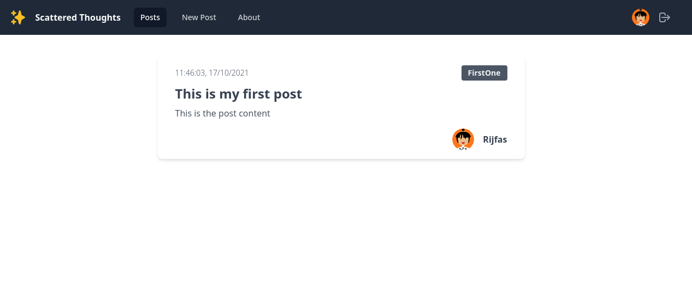

<div id="top"></div>

[![Contributors][contributors-shield]][contributors-url]
[![Forks][forks-shield]][forks-url]
[![Stargazers][stars-shield]][stars-url]
[![Issues][issues-shield]][issues-url]
[![MIT License][license-shield]][license-url]
[![LinkedIn][linkedin-shield]][linkedin-url]

<!-- PROJECT LOGO -->
<br />
<div align="center">
  <a href="https://github.com/rijfas/saturday-hacknight-googlesheets">
    
  </a>

  <h3 align="center">Scattered Thoughts</h3>

  <p align="center">
    A simple blog web app using google sheets!
    <br />
    <a href="https://scattered-thoughts-shn.netlify.app"><strong>Open Deployed Project »</strong></a>
    <br />
    <br />
    <a href="https://scattered-thoughts-shn.netlify.app">View Demo</a>
    ·
    <a href="https://github.com/rijfas/saturday-hacknight-googlesheets/issues">Report Bug</a>
    ·
    <a href="https://rijfas/saturday-hacknight-googlesheets/issues">Request Feature</a>
  </p>
</div>

<!-- TABLE OF CONTENTS -->
<details>
  <summary>Table of Contents</summary>
  <ol>
    <li>
      <a href="#about-the-project">About The Project</a>
      <ul>
        <li><a href="#built-with">Built With</a></li>
      </ul>
    </li>
    <li>
      <a href="#getting-started">Getting Started</a>
      <ul>
        <li><a href="#prerequisites">Prerequisites</a></li>
        <li><a href="#installation">Installation</a></li>
      </ul>
    </li>
    <li><a href="#usage">Usage</a></li>
    <li><a href="#roadmap">Roadmap</a></li>
    <li><a href="#contributing">Contributing</a></li>
    <li><a href="#license">License</a></li>
    <li><a href="#contact">Contact</a></li>
    <li><a href="#acknowledgments">Acknowledgments</a></li>
  </ol>
</details>

<!-- ABOUT THE PROJECT -->

## About The Project



There are many great social meadia/blog sites, but ever heard of a blog built with google sheets?, if no then here is one.

Major features:

- Users can login !
- Users can post their thoughts
- They can logout too :smile:

<p align="right">(<a href="#top">back to top</a>)</p>

### Built With

This web app is built within a short timespan, so major improvements on the way !!!. Main technologies used are:

- [HTML](https://nextjs.org/)
- [CSS](https://reactjs.org/)
- [JavaScript](https://vuejs.org/)
- [Tailwind css](https://angular.io/)
- [Netlify](https://svelte.dev/)
- [Heroicons](https://laravel.com)
- [MultiAvatar](https://multiavatar.com/)
- [Google Sheets](https://jquery.com)

<p align="right">(<a href="#top">back to top</a>)</p>

<!-- GETTING STARTED -->

## Getting Started

The project is built on top of google sheets so the deployment is costless since it's just a front end.

### Prerequisites

A google account is needed for creating a sheet and to connect with the fron end.

### Installation

1. Create a new google sheet

2. Goto tools -> script editor

3. Paste the following code

```js
var config = PropertiesService.getScriptProperties();

function setup() {
  var doc = SpreadsheetApp.getActiveSpreadsheet();
  config.setProperty("key", doc.getId());
}

function doGet(e) {
  var params = e.parameter;
  var myJSON = JSON.stringify(getDataFromSheet("Sheet1"));
  return ContentService.createTextOutput(myJSON).setMimeType(
    ContentService.MimeType.JSON
  );
}

function decodeUriMessage(message) {
  let decodedMessage = decodeURI(message);
  return decodedMessage.replace(/\+/g, " ");
}

function extractData(content) {
  content = JSON.parse(content);
  return [content.user, content.category, content.title, content.content];
}

function getTimeStamp() {
  const currentDate = new Date();
  return (
    currentDate.toLocaleTimeString() + ", " + currentDate.toLocaleDateString()
  );
}

function doPost(e) {
  var doc = SpreadsheetApp.openById(config.getProperty("key"));
  doc.appendRow([getTimeStamp(), ...extractData(e.postData.contents)]);
  return ContentService.createTextOutput(
    JSON.stringify(extractData(e.postData))
  ).setMimeType(ContentService.MimeType.JSON);
}

function getDataFromSheet(table) {
  try {
    var doc = SpreadsheetApp.openById(config.getProperty("key"));
    var sheet = doc.getSheetByName(table);

    if (!sheet) {
      return {
        status: "table not found",
      };
    }

    var header = sheet.getRange(1, 1, 1, sheet.getLastColumn()).getValues()[0];
    var data = sheet
      .getRange(2, 1, sheet.getLastRow() - 1, sheet.getLastColumn())
      .getValues();

    var result = data.map(function (values, index, array) {
      var obj = {};
      for (var i = 0; i < header.length; i++) {
        obj[header[i]] = values[i];
      }
      return obj;
    });

    return result;
  } catch (e) {
    return {
      status: "error",
      description: e,
    };
  }
}
```

5. save and run setup()

6. Deploy as webapp

7. Get deployment url

8. set deployment url in js

<p align="right">(<a href="#top">back to top</a>)</p>

<!-- USAGE EXAMPLES -->

## Usage

Users can login and add new posts logout..etc.

_For more examples, please refer to the [Documentation](https://example.com)_

<p align="right">(<a href="#top">back to top</a>)</p>

<!-- ROADMAP -->

## Roadmap

- [x] Create base platform
- [x] Ability to create posts
- [] Ability to delete posts
- [] Ability to edit posts
- [] Extra features
  - [] Custom emoji
  - [] Filtered posts

See the [open issues](https://github.com/rijfas/saturday-hacknight-googlesheets/issues) for a full list of proposed features (and known issues).

<p align="right">(<a href="#top">back to top</a>)</p>

<!-- CONTRIBUTING -->

## Contributing

Contributions are what make the open source community such an amazing place to learn, inspire, and create. Any contributions you make are **greatly appreciated**.

If you have a suggestion that would make this better, please fork the repo and create a pull request. You can also simply open an issue with the tag "enhancement".
Don't forget to give the project a star! Thanks again!

1. Fork the Project
2. Create your Feature Branch (`git checkout -b feature/AmazingFeature`)
3. Commit your Changes (`git commit -m 'Add some AmazingFeature'`)
4. Push to the Branch (`git push origin feature/AmazingFeature`)
5. Open a Pull Request

<p align="right">(<a href="#top">back to top</a>)</p>

<!-- LICENSE -->

## License

Distributed under the MIT License. See `LICENSE.txt` for more information.

<p align="right">(<a href="#top">back to top</a>)</p>

<!-- CONTACT -->

## Contact

Rijfas - [@rijfas](https://github.com/rijfas/) - rijfas01@gmail.com

Project Link: [https://github.com/rijfas/saturday-hacknight-googlesheets/tree/master](https://github.com/rijfas/saturday-hacknight-googlesheets/tree/master)

<p align="right">(<a href="#top">back to top</a>)</p>

<!-- ACKNOWLEDGMENTS -->

## Contributers

- [Nidha Shoukhath K P](https://github.com/nidhashoukhath)
- [Umayya Nahan A P](https://github.com/UmayyaNahanAP)
- [Muhammad Rasil K P](https://github.com/rasilkp/rasilkp)
- [Jafna K](https://grid.malven.co/)

<p align="right">(<a href="#top">back to top</a>)</p>

<!-- MARKDOWN LINKS & IMAGES -->
<!-- https://www.markdownguide.org/basic-syntax/#reference-style-links -->

[contributors-shield]: https://img.shields.io/github/contributors/rijfas/saturday-hacknight-googlesheets.svg?style=for-the-badge
[contributors-url]: https://github.com/rijfas/saturday-hacknight-googlesheets/graphs/contributors
[forks-shield]: https://img.shields.io/github/forks/rijfas/saturday-hacknight-googlesheets.svg?style=for-the-badge
[forks-url]: https://github.com/rijfas/saturday-hacknight-googlesheets/network/members
[stars-shield]: https://img.shields.io/github/stars/rijfas/saturday-hacknight-googlesheets.svg?style=for-the-badge
[stars-url]: https://github.com/rijfas/saturday-hacknight-googlesheets/stargazers
[issues-shield]: https://img.shields.io/github/issues/rijfas/saturday-hacknight-googlesheets.svg?style=for-the-badge
[issues-url]: https://github.com/rijfas/saturday-hacknight-googlesheets/issues
[license-shield]: https://img.shields.io/github/license/rijfas/saturday-hacknight-googlesheets.svg?style=for-the-badge
[license-url]: https://github.com/rijfas/saturday-hacknight-googlesheets/blob/master/LICENSE.txt
[linkedin-shield]: https://img.shields.io/badge/-LinkedIn-black.svg?style=for-the-badge&logo=linkedin&colorB=555
[linkedin-url]: https://linkedin.com/in/othneildrew
[product-screenshot]: images/screenshot.png
